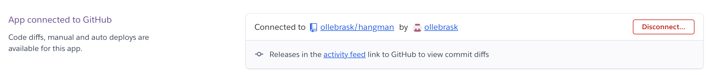
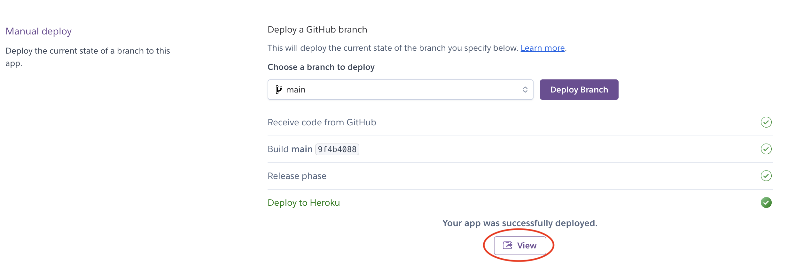

# Hangman Game


*The link to [Hangman Game](https://hangman-olle-f5e67dd225fc.herokuapp.com/)*

The Hangman Game is a Python terminal project.


---

## How to play:

  1. Click this *[link](https://hangman-olle-f5e67dd225fc.herokuapp.com/)*
  2. As soon as the page is loaded, click 'RUN PROGRAM'.
  3. Choose to show rules if you are new to the game.
  4. Choose difficulty (1, 2 or 3)
  5. Guess a letter and press Enter
  6. If you guess 5 letters incorrect, you lose the game. If you guess all the correct letters, you win.
  7. Choose if you want to play again, maybe with a different difficulty?
  

---
## User Stories

  * As a visitor, i want to play a fun and challenging game.
  * As a visitor, i want to easily understand how the game works.
  * As a visitor, i want to easily navigate through the game.
  * As a visitor, i want to have clear and unambigous feedback during the game.
  * As a visitor, i want to play the game without any issues.

---

## Features
  
  - **When the program is loaded**

  The user can see a welcoming message and a terminal menu with two options:

    1. Read rules

    2. Choose difficulty
  
  

  - **When the user select Read rules**

  The user can see a list of rules and a terminal menu with three difficulties to choose from.
  In the previous terminal menu if the user chooses number 2, the same terminal menu will be shown:

    1. for easy

    2. for medium

    3. for hard

  

  - **When the user selects a difficulty**

  At the top the user is presented which difficulty was chosen.
  Underneath is an empty frame for the hangman.
  There are three fields shown:
  
    1. (Used letters:) Here the user will see the letters guessed.

    2. (Word:) This shows the number of letters in the word.

    3. (Guess a letter:) Input field for the user to write a letter.

  

  - **When the user selects wrong letter**

  At the top the user will see a message: Incorrect. You have x guesses left.
  A body part will be shown in the hangman frame.
  The letter will be added to the (Used letters:)

  

  - **When the user selects a correct letter**

  At the top the user will see a message: Correct!
  The letter will be added to the (Used letters:)
  The letter will be visual in the right place of (Word:)

  

   - **When the user inputs invalid data**

  If the user inputs anything else than one letter this will happen:

  At the bottom a message will be shown: Invalid input. Please enter only a single letter.
  Underneth it the user is able to (Guess a letter:) again.

  

  - **When the user is out of guesses**

  The user can see the whole hangmans body.
  A text will be shown with the correct word: Game Over. The word was xxxxx.
  A terminal menu will be shown:

    Play again?

    1. Yes (This will restart the game and the user returns to the start)

    2. No (This will end the game, a text will be shown: Thank you for playing 😄)

  

  - **When the user guesses all correct letters**

  A text will be shown with the correct word: Congratulations! You guessed the word xxxxx.
  A terminal menu will be shown:

    Play again?

    1. Yes (This will restart the game and the user returns to the start)

    2. No (This will end the game, a text will be shown: Thank you for playing 😄)

  
---

## Flowchart


  


---
## Technologies Used

### Languages:

- [Python 3.12.2](https://www.python.org/downloads/release/python-3122/): used to anchor the project and direct all application behavior.

- [JavaScript](https://www.javascript.com/): used to provide the start script needed to run the Code Institute mock terminal in the browser.

- [HTML](https://developer.mozilla.org/en-US/docs/Web/HTML) used to construct the elements involved in building the mock terminal in the browser.

### Frameworks/Libraries, Programmes and Tools:
#### Python modules/packages:

##### Standard library imports:

- [random](https://docs.python.org/3/library/random.html) was used to implement pseudo-random number generation.
- [os](https://docs.python.org/3/library/os.html ) was used to clear the terminal.
##### Third-party imports:

- [Simple Terminal Menu](https://pypi.org/project/simple-term-menu/) was used to implement the menu.
- [Colorama](https://pypi.org/project/colorama/) was used to add colors and styles to the project.

#### Other tools:

- [GitPod](https://www.gitpod.io/) was used as the main tool to write and edit code.
- [Git](https://git-scm.com/) was used for the version control of the website.
- [GitHub](https://github.com/) was used to host the code of the website.
- [Lucidspark](https://www.lucidspark.com/) was used to make a flowchart for the README file.
- [Heroku](https://www.heroku.com/) was used to deploy the project.

---
## Bugs

+ **Solved bugs**

1. The function ```clear_terminal()``` didn't work at the correct time, it was interferring with the if, elif, else-statements. Former placement for function commented out in code below.

    - *Solutions:* Moved the ```clear_terminal()``` function inside of each if,elif,else-statement. See in the code below:

     ```python
    def game(word):
    """
    Printing the stage based on guesses and guessed letters
    Input for guessing letters
    When out of guesses or all correct letters, retry function runs
    """
    guesses = 5
    guessed_letters = set()
    while guesses > 0 and not all(
            letter in guessed_letters for letter in word):
        # clear_terminal()
        print(stages.stages[5 - guesses])
        print("Used letters:", " ".join(guessed_letters))
        print(
            "Word:", " ".join(
                letter if letter in guessed_letters
                else "_" for letter in word))

        while True:
            guess = input("Guess a letter: \n").strip().lower()
            if len(guess) == 1 and guess.isalpha():
                break
            else:
                print("Invalid input. Please enter only a single letter.")

        if guess in guessed_letters:
            clear_terminal()
            print("You already guessed that letter!")
        elif guess in word:
            clear_terminal()
            guessed_letters.add(guess)
            print("Correct!")
        else:
            clear_terminal()
            guessed_letters.add(guess)
            guesses -= 1
            print(f"Incorrect. You have {guesses} guesses left.")
      ```

+ **Unsolved bugs**

None

---
## Testing

Please refer to the [TESTING.md](TESTING.md) file for all test related documentation.

---
## Deployment

- The program was deployed to [Heroku](https://dashboard.heroku.com).


### To deploy the project to Heroku:

- Clone the repository:
1. Open a new folder in your IDE(Integrated Development Environment)

2. Run the following command
  - `git clone https://github.com/ollebrask/hangman.git`

3. Create your own GitHub repository to host the code.
4. Run the command `git remote set-url origin <Your GitHub Repository Path>` to set the remote repository location to your repository.

5. Push the files to your repository with the following command: `git push`

6. Create a Heroku account if you don't already have one here [Heroku](https://dashboard.heroku.com).

7. Create a new Heroku application on the following page here [New Heroku App](https://dashboard.heroku.com/apps):

  

8. Go to the Deploy tab:

  

  

9. Link your GitHub account and connect the application to the repository you created.

  

10. Go to the Settings tab:

  

11. Click "Add buildpack":

  

12. Add the Python and Node.js buildpacks in the following order:

  

13. Click "Reveal Config Vars."

  

14. Add 1 new Config Vars:
  - Key: PORT Value: 8000
  - This Config was provided by [Code Institute](https://codeinstitute.net/)

15. Go back to the Deploy tab:

  

16. Click "Deploy Branch":

  

  - Wait for the completion of the deployment.

  

17. Click "Open app" to launch the application inside a web page.

  

---

## Credits

- Color formatting: [Colorama](https://pypi.org/project/colorama/).
- Terminal menu: [Simple Terminal Menu](https://pypi.org/project/simple-term-menu/).
- [Heroku](https://www.heroku.com/) for hosting the application.
- Clear the terminal: [Stackoverflow](https://stackoverflow.com/questions/2084508/clear-the-terminal-in-python)
- Inspiration and structure of the README: [IuliiaKonovalova](https://github.com/IuliiaKonovalova/madlib_with_python/)
- Github were used to store my repository: [GitHub](https://github.com)
- For finding usable functions [w3schools](https://www.w3schools.com/python)

---
## Acknowledgements

My mentor for valuable feedback! [Iuliia Konovalova](https://github.com/IuliiaKonovalova)
