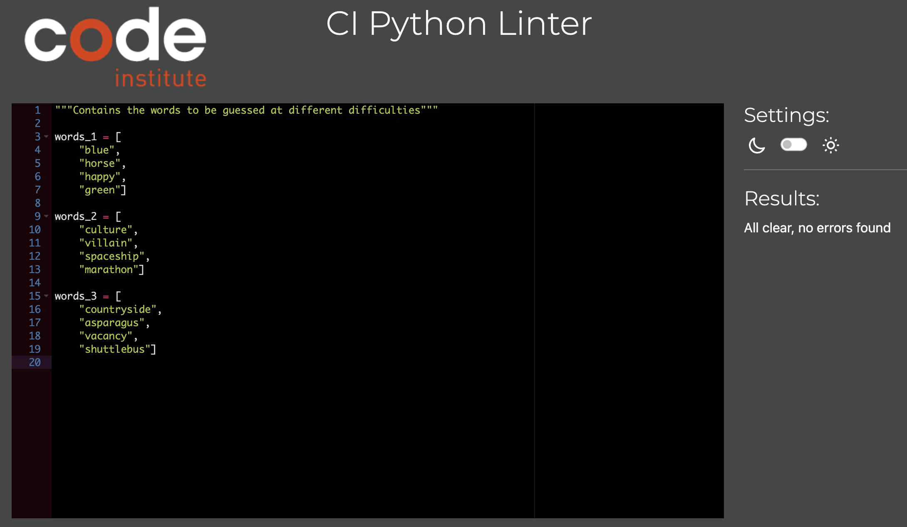
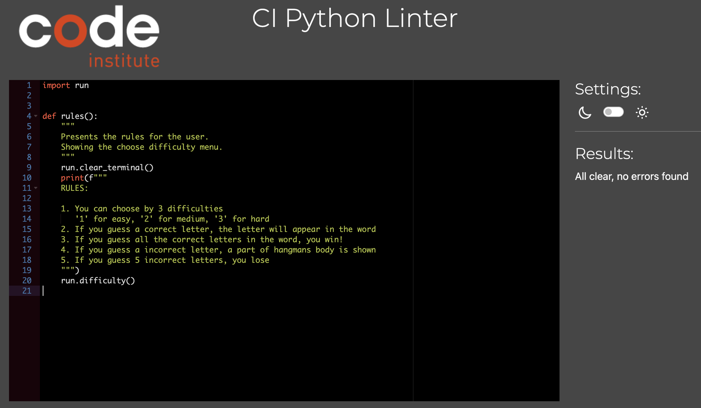
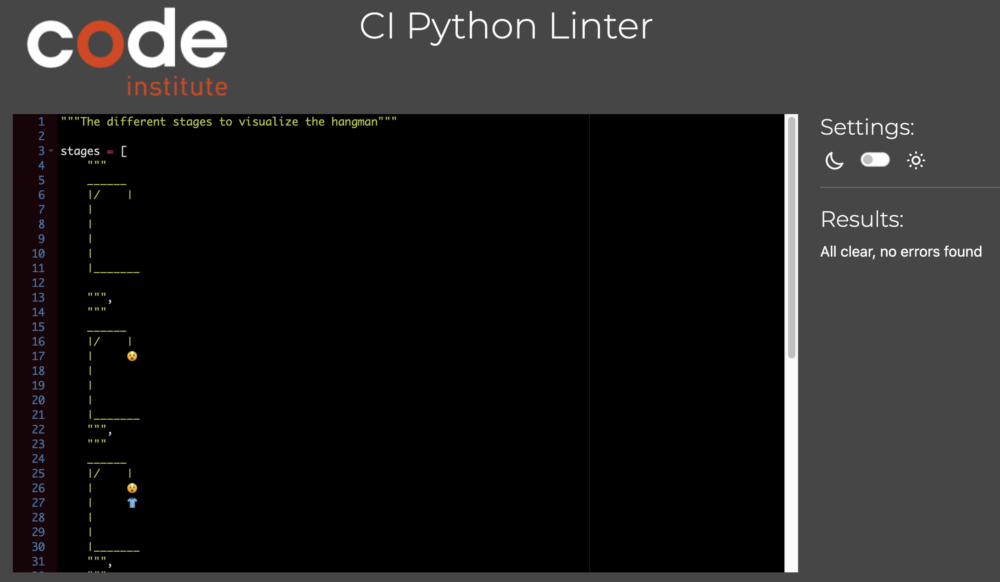

## Testing

The code was tested frequently during the process.

### Manual input testing

| feature | action | expected result | tested | passed | comments |
| --- | --- | --- | --- | --- | --- |
| Input | | | | | |
|  | Try to input sign "?" | Input is not accepted | Yes | Yes | - |
|  | Try to input number "3" | Input is not accepted | Yes | Yes | - |
|  | Try to input two letters "ab" | Input is not accepted | Yes | Yes | - |
|  | Try to input uppercase letter "A" | Input is accepted | Yes | Yes | - |
|  | Try to input spaces and letter " a   " | Input is accepted | Yes | Yes | - |
| Terminal menus | | | | | |
| 1 | Choose 'Read rules' | Directed to rules | Yes | Yes | - |
| 1 | Choose 'Choose difficulty' | Directed to difficulties | Yes | Yes | - |
| 2 | Choose '1' | Game starts with difficulty 1 | Yes | Yes | - |
| 2 | Choose '2' | Game starts with difficulty 2 | Yes | Yes | - |
| 2 | Choose '3' | Game starts with difficulty 3 | Yes | Yes | - |
| 3 | Choose 'Yes' | Game restarts | Yes | Yes | - |
| 3 | Choose 'No' | Game ends | Yes | Yes | - |

---

### Validators

Code Instites's [CI Python Linter](https://pep8ci.herokuapp.com/#) was used to validate the code. The code was copied and pasted into the validator.

No errors were found:

- **run.py**

- **words.py**

- **rules.py**

- **stages.py**

---